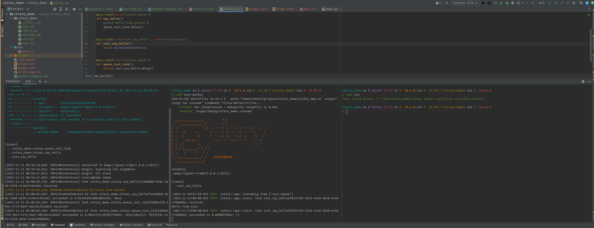

# Celery rust/python interop demo



# How to run

1. Run rabbitmq with `docker compose up -d`
2. Set up rabbitmq
    ```
    docker compose exec rabbitmq rabbitmqctl add_user myuser mypassword
    docker compose exec rabbitmq rabbitmqctl add_vhost myhost
    docker compose exec rabbitmq rabbitmqctl set_user_tags myuser mytag
    docker compose exec rabbitmq rabbitmqctl set_permissions -p myhost myuser ".*" ".*" ".*"
    ```
3. Run celery worker with `task worker` (or check the taskfile for the apt. command)
4. Run rust worker with `task rust-worker`
5. Fire a task with `task run`

